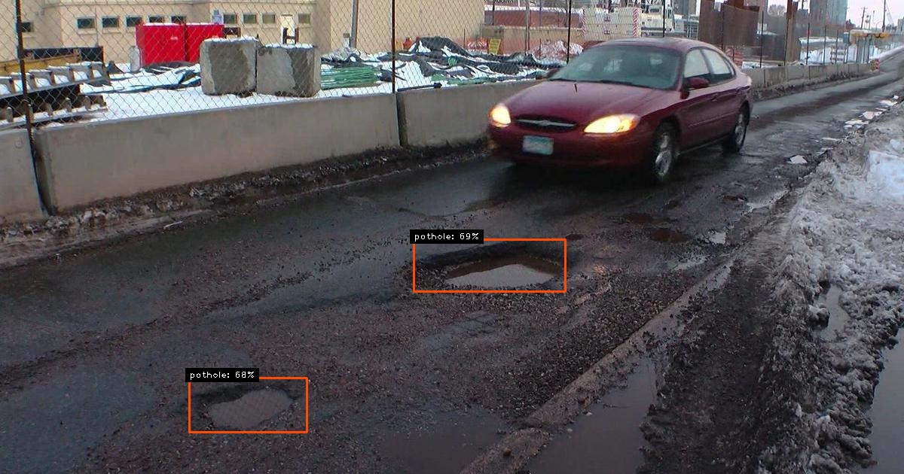
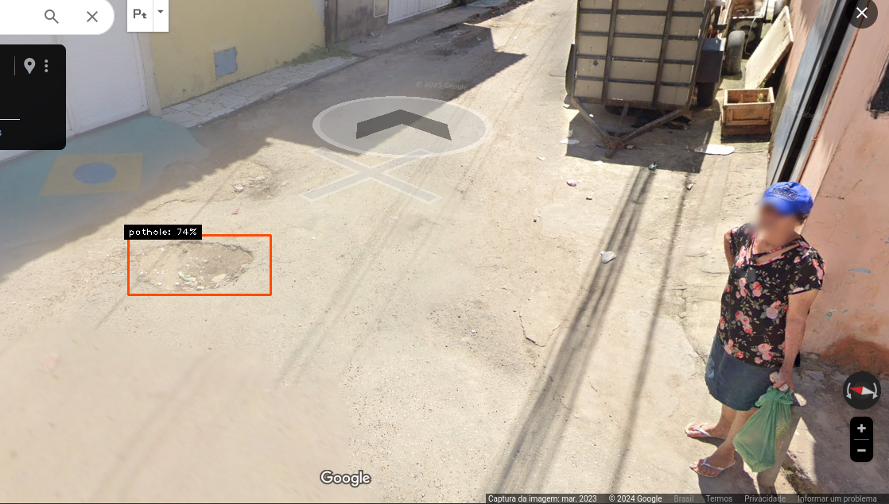
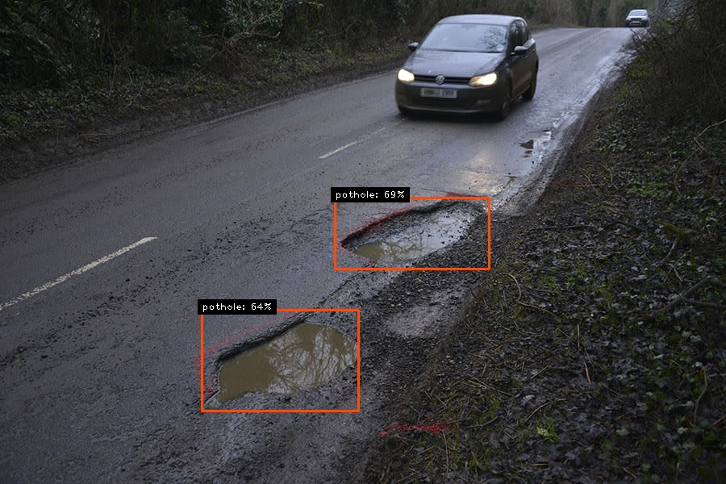
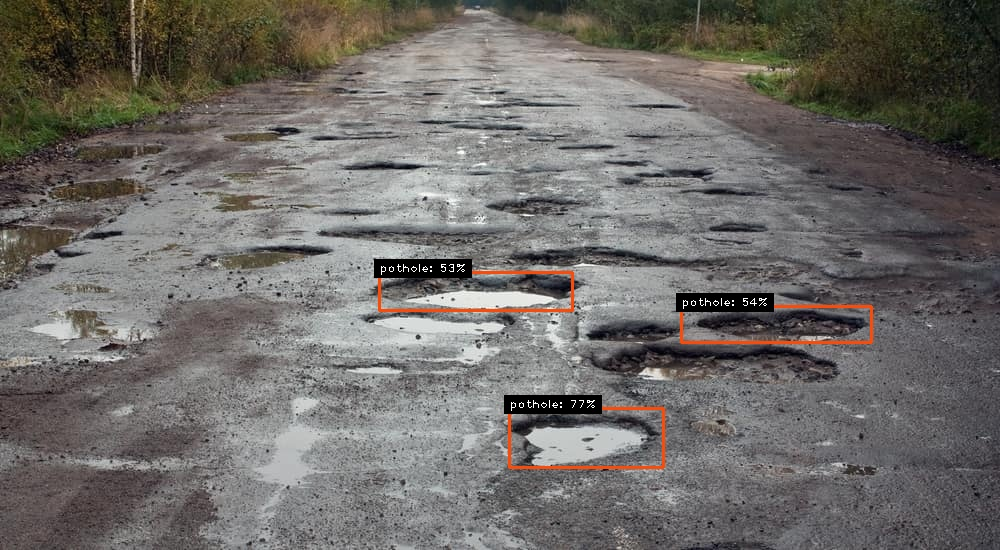
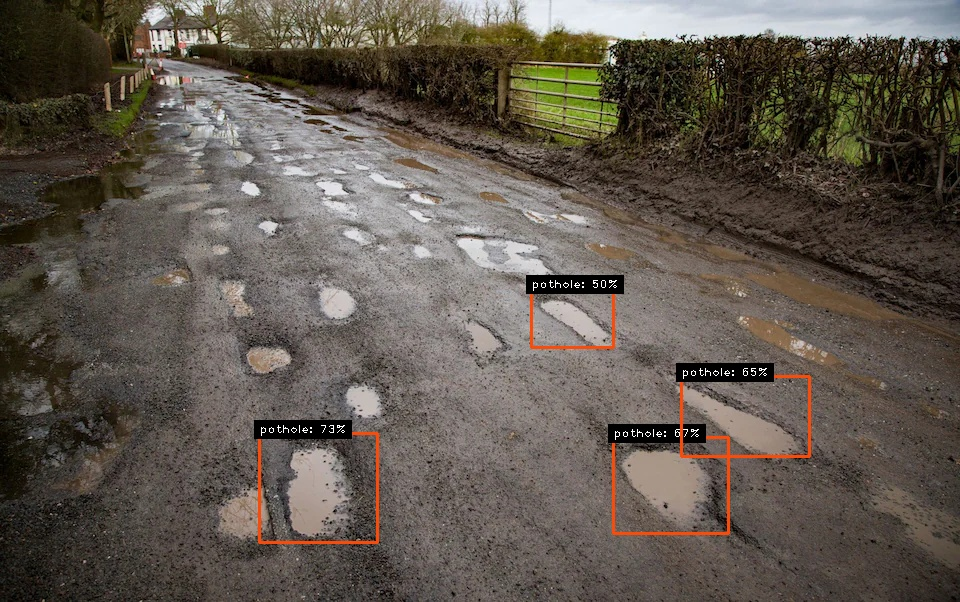
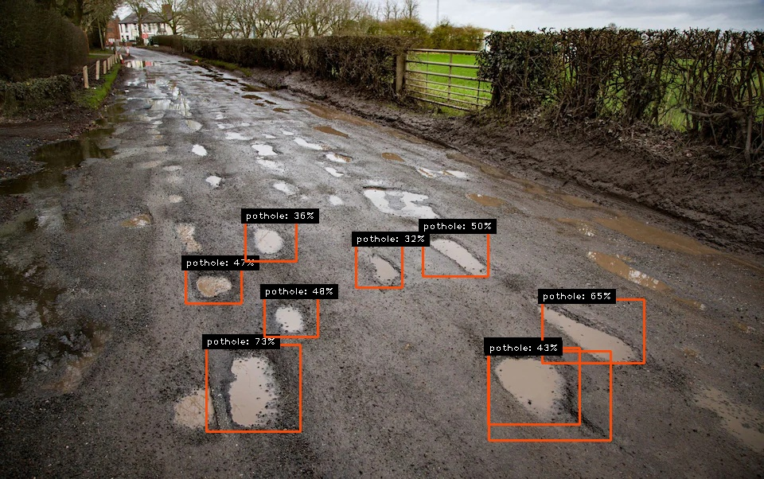

# Projeto de TCC para a detecção de buracos em vias asfaltadas

Detecção de buracos utilizando um modelo Mobilenet-SSD treinado com um custom dataset na biblioteca TensorFlow

Projeto realizado por [José Wagner](https://github.com/WagnerRochaJ) e [Lucas Pinheiro](https://github.com/gimn0).

#

<br>


<br>

Codigo de Predição baseado em:
<br>
https://github.com/EdjeElectronics/TensorFlow-Lite-Object-Detection-on-Android-and-Raspberry-Pi/tree/master

https://github.com/tensorflow/tensorflow/blob/master/tensorflow/lite/examples/python/label_image.py

#

### Dependencias Necessárias
- tensorflow
- opencv
- numpy
- cvzone

#
### Exemplos de execução:

Execucão com imagem:
```
python TFLite-detection-image.py --modeldir=custom_model_lite --image=test_images/pothole.jpg
```
Execução com um diretório de imagens:
```
python TFLite-detection-image.py --modeldir=custom_model_lite --imagedir=test_images
```
Execução com vídeo:
```
python TFLite-detection-video.py --modeldir=custom_model_lite --video=test_video/video1.mp4 
```
Caso queira alterar a quantidade de detecções, adicione "--threshold= 0.5"
<br>

Exemplo para 40%:
```
python TFLite-detection-image.py --modeldir=custom_model_lite --imagedir=test_images --threshold= 0.4

```




#
### Comparação de duas imagens. Uma com 50% e outra com 30%.
<br>

detecção a partir de 50%
<br>

#

<br>

detecção a partir de 30%
<br>
